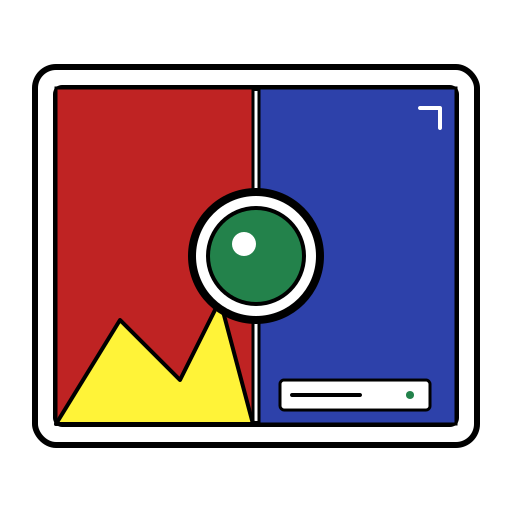
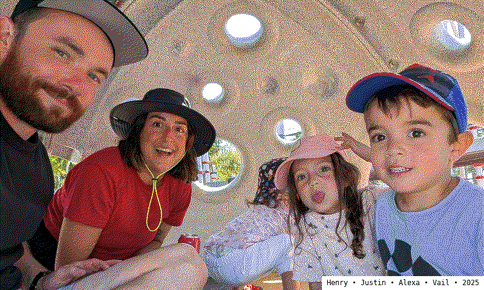
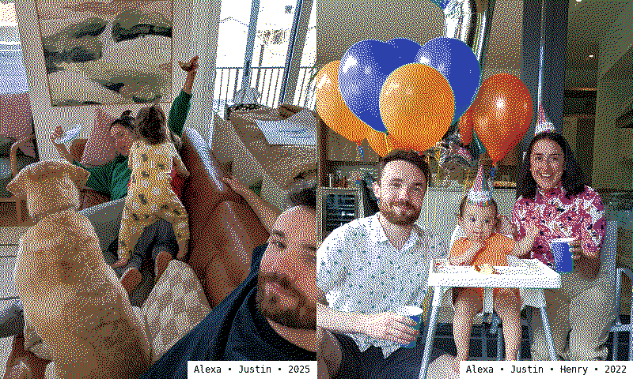

[](https://github.com/jabes/immich-epaper/actions/workflows/build-and-push.yml)

# Immich e-Paper Server

An aesthetic, containerized Flask web server that interfaces with your self-hosted **Immich** instance to serve dynamic photo frames or multi-photo layouts optimized specifically for e-Paper electronic ink displays (such as 7-color palettes, custom rotations, and specific byte packing layouts).

It features an analytical image quality ranking pipeline using `pyiqa` and custom OpenCV analytics, ensuring your digital e-ink frame always selects the highest-quality, best-composed imagery from your library.


## Features

* **Multi-Layout Compositions:** Supports single landscape/portrait frames or dynamic **Duo** multi-photo frames based on configurable orientation properties and custom probabilities.
* **Smart Face-Aware Cropping:** Integrates directly with Immich’s face detection and fallback bounding box coordinates to ensure family and friends are beautifully center-staged instead of awkwardly cropped.
* **Perceptual Image Quality Assessment (IQA):** Utilizes NIMA (Neural Image Assessment), BRISQUE, and OpenCV Laplacian variance calculations to rank batches of candidate configurations and only serve the most clear, well-exposed layouts.
* **e-Paper Packing Engine:** Provides raw multi-chromatic color quantization (`/frame.bin`) utilizing custom color LUT mapping and high-quality Floyd-Steinberg dithering tailored for physical panels.
* **Debugging Previews:** Delivers standard browser-readable endpoints (`/frame.png` and `/frame.jpg`) showing real-time text labels, dates, and dither status for effortless alignment checking.


## Environment Variables

| Variable | Default | Description |
| --- | --- | --- |
| `IMMICH_URL` | `http://immich-server:2283` | The internal backend network URL of your Immich server instance. |
| `IMMICH_PUBLIC_URL` | *(Same as URL)* | The customer-facing base URL used for logging interactive browser links. |
| `IMMICH_API_KEY` | **(Required)** | Your Immich account personal API authentication key. |
| `IMMICH_ALBUM_ID` | *(Optional)* | Limits selection to assets contained in a specific Immich Album ID. If left empty, library search mode is used. |
| `IMMICH_DEVICE_ORIENTATION` | `landscape` | Structural canvas orientation. Accepts: `landscape`, `portrait`. |
| `IMMICH_DUO_PROBABILITY` | `0.5` | Floating percentage probability (`0.0` to `1.0`) of rendering a split 2-photo layout versus a standard single image. |
| `IMMICH_ASSET_ORIENTATION` | `any` | Filter out assets that don't match this native layout constraint. Accepts: `any`, `landscape`, `portrait`, `square`. |
| `IMMICH_CROP` | `center` | Image geometry adaptation mode. Accepts: `center`, `smart` (uses Immich face data). |
| `IMMICH_QUALITY_ENABLED` | `true` | Enables/disables the `pyiqa` batch pipeline framework to save CPU/GPU cycles. |
| `IMMICH_RANKING_BATCH` | `5` | How many unique random layouts to evaluate and rank before serving the top score. |
| `IMMICH_INCLUDE_PEOPLE` | *(Optional)* | Comma-separated list of Immich Person IDs to target. |
| `IMMICH_REQUIRE_ALL_PEOPLE` | `false` | If `true`, search requires all targeted Person IDs to coexist in the photo. |
| `IMMICH_EXCLUDE_PEOPLE` | *(Optional)* | Comma-separated list of Immich Person IDs to black-list from display. |
| `IMMICH_DATE_AFTER` | *(Optional)* | Absolute string date or relative offset (`365d`, `yesterday`) to filter assets. |
| `IMMICH_DATE_BEFORE` | *(Optional)* | Absolute string date or relative offset to cap historical selection. |
| `IMMICH_SHOW_NAMES` | `true` | Superimposes recognized person names along with the creation year onto the panel. |
| `FRAME_ROTATE` | `0` | Final hardware correction angle applied to canvas. Accepts: `90`, `180`, `270`. |
| `LOG_LEVEL` | `INFO` | Adjust application output reporting verbosity (`DEBUG`, `INFO`, `WARNING`, `ERROR`). |


## API Endpoints

### `GET /frame.bin`

Returns a raw, uncompressed binary packet matching standard high-efficiency e-paper 4-bit packed byte structures. Fully dithered using a targeted 6-color hardware palette palette:

* ⬛ Black, ⬜ White, 🟨 Yellow, 🟥 Red, 🟦 Blue, 🟩 Green

### `GET /frame.png`

Serves a high-fidelity lossless preview image reflecting the exact color-quantized matrix and dithering artifacts currently rendering on the bin engine. Useful for standard browser embedding or debugging layout scripts.

### `GET /frame.jpg`

Serves a smooth, non-dithered JPEG rendition of the composed layout with 85% compression efficiency. Perfect for testing layout proportions or rendering on general digital picture frames.

### `GET /healthz`

Simple monitoring endpoint returning service state and active album context.


## Local Development

Install the required Python runtime, isolate your workspace environment, and pull down the packages needed for proper IDE code completion and typing support:

```bash
pyenv install 3.12 --skip-existing
pyenv local 3.12
pyenv deactivate
pyenv virtualenv-delete --force immich-epaper
pyenv virtualenv 3.12 immich-epaper
pyenv activate immich-epaper
pip install --upgrade wheel setuptools pip
pip install --requirement requirements.txt
```


## Examples



